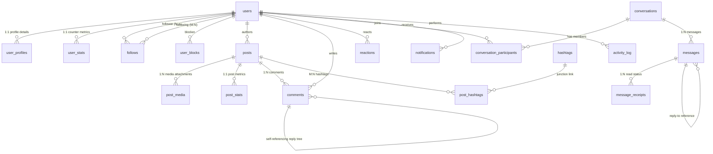

# Database Schema Documentation & Technical Assessment Report

## 1. Executive Summary

This document details the normalized relational database architecture designed for a high-scale social media platform. The database schema is engineered for **PostgreSQL 14+** and adheres strictly to **Third Normal Form (3NF)** data integrity principles while incorporating strategic, controlled denormalization (such as counter tables) to ensure high-performance execution of feed generation and activity queries.

### Key Architectural Highlights
- **Engine**: PostgreSQL 14+
- **Normalization Standard**: 3NF with localized 1:1 table separation and counter denormalization
- **Primary Key Strategy**: 64-bit `BIGSERIAL` / `BIGINT` auto-incrementing integers for optimal B-Tree index memory density
- **Temporal Tracking**: `TIMESTAMPTZ` across all entities to support multi-region timezone awareness
- **Soft Deletion**: `deleted_at TIMESTAMPTZ` column pattern on core content tables (`posts`, `comments`, `messages`)

---

## 2. Complete Entity-Relationship Diagram (ERD)



---

## 3. Schema Data Dictionary & Table Specifications

### 3.1 User & Identity Management
- **`users`**: Core credentials and authentication state. Contains strict `CHECK` constraints on email format and username length.
- **`user_profiles`**: Volatile user profile metadata (bio, avatar, display name). Separated from `users` to minimize lock contention during profile updates.
- **`user_stats`**: Denormalized counters (`followers_count`, `following_count`, `posts_count`) maintained asynchronously or via triggers for instant $O(1)$ profile count reads.

### 3.2 Relationships & Graph Layer
- **`follows`**: Directed graph edges for follower/following relationships. Uses compound unique constraint `(follower_id, following_id)` to eliminate duplicate follow entries and power $O(\log N)$ relationship checks.
- **`user_blocks`**: Tracks blocklists to filter feeds and private messaging.

### 3.3 Content & Media Layer
- **`posts`**: Main content entity with `post_visibility` enums (`public`, `followers_only`, `private`), soft delete support (`deleted_at`), and optional geographic coordinates.
- **`post_media`**: 1:N media attachments storing URL, width, height, duration, and sort order.
- **`hashtags` & `post_hashtags`**: Fully normalized M:N junction structure enabling hashtag discovery and trending analysis.
- **`post_stats`**: Counter table tracking `likes_count`, `comments_count`, `shares_count`, and `views_count`.

### 3.4 Interactions Layer
- **`comments`**: Threaded discussion hierarchy using self-referencing `parent_id` with `depth` restriction (max level 5) to prevent infinite recursive queries.
- **`reactions`**: Single polymorphic table handling user reactions for both posts and comments (`reactable_type`, `reactable_id`, `reaction_type`).

### 3.5 Private Messaging System
- **`conversations`**: Chat sessions (supports both 1:1 direct messages and group conversations).
- **`conversation_participants`**: Joins users to conversations, tracking member roles, muted state, and `last_read_at` timestamps for unread calculation.
- **`messages`**: Text and multimedia message entities.
- **`message_receipts`**: Detailed per-recipient delivery and read timestamps for group chat receipt verification.

### 3.6 Activity & Notifications Layer
- **`notifications`**: User alert inbox with support for notification aggregation via `group_key` (e.g. "User X and 10 others liked your post").
- **`activity_log`**: Historical system event log.

---

## 4. Database Normalization & Integrity Proof

### 4.1 Third Normal Form (3NF) Compliance Analysis
1. **First Normal Form (1NF)**:
   - All columns contain atomic, scalar values (e.g. separate media records rather than comma-separated URLs).
   - Each table possesses a defined Primary Key.
2. **Second Normal Form (2NF)**:
   - All non-key attributes are fully dependent on the complete Primary Key. Junction tables like `post_hashtags` use composite primary keys `(post_id, hashtag_id)` where dependencies strictly match both attributes.
3. **Third Normal Form (3NF)**:
   - No transitive dependencies exist. For example, profile display name is dependent solely on `user_id` in `user_profiles`, not transitively linked through post records.

### 4.2 Justification for Controlled Denormalization
Pure 3NF would require calculating `COUNT(*)` across millions of rows in `follows` and `reactions` every time a user views a profile or feed post. To eliminate read bottlenecks, `user_stats` and `post_stats` isolate counts into dedicated counter rows updated asynchronously via triggers or background Redis write-behind queues.

---

## 5. Indexing & Query Efficiency Blueprint

| Table | Index Signature | Index Type | Query Target / Usecase |
| :--- | :--- | :--- | :--- |
| `posts` | `(user_id, created_at DESC) WHERE deleted_at IS NULL` | B-Tree Partial | User Profile Feed Query |
| `posts` | `(created_at DESC) WHERE deleted_at IS NULL` | B-Tree Partial | Global Feed / Discovery Query |
| `posts` | `(created_at)` | BRIN | Time-series historical archive scans |
| `users` | `(username)` | GIN Trigram | Fast `LIKE '%term%'` search |
| `follows` | `(following_id, status)` | B-Tree | "Who follows this user?" checks |
| `notifications`| `(recipient_id) WHERE is_read = FALSE` | B-Tree Partial | Instant unread notification badge counter |
| `comments` | `(post_id, created_at ASC) WHERE deleted_at IS NULL` | B-Tree Partial | Fetching ordered comments under a post |

---

## 6. Scalability & Infrastructure Expansion Strategy

As the platform scales beyond tens of millions of active users, the following database sharding and partitioning strategies should be implemented:

```
                            [PostgreSQL Primary Router]
                                         │
                 ┌───────────────────────┼───────────────────────┐
                 │                       │                       │
                 ▼                       ▼                       ▼
      [Partition 2026_Q1]     [Partition 2026_Q2]     [Partition 2026_Q3]
      (Posts & Activity)      (Posts & Activity)      (Posts & Activity)
```

1. **Declarative Range Partitioning for Time-Series Tables**:
   Partition `posts`, `activity_log`, and `messages` by range on `created_at` (e.g. monthly or quarterly partitions). This keeps index sizes small and permits instant dropping of old data partitions (`DROP TABLE posts_y2024m01`).
2. **Horizontal Database Sharding**:
   Shard users and their associated posts/messages using `user_id % N` hash sharding across independent database instances.
3. **Read Replicas & Connection Pooling**:
   Deploy **PgBouncer** for transactional connection pooling and direct 90% of read-only queries (feeds, profiles) to read replicas.
