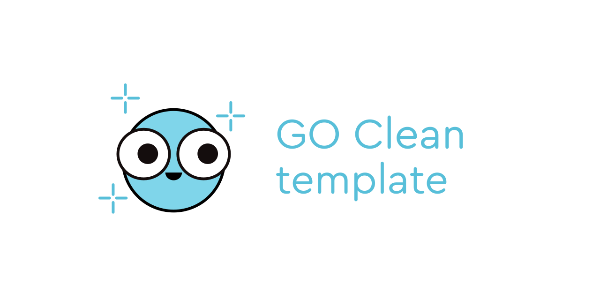
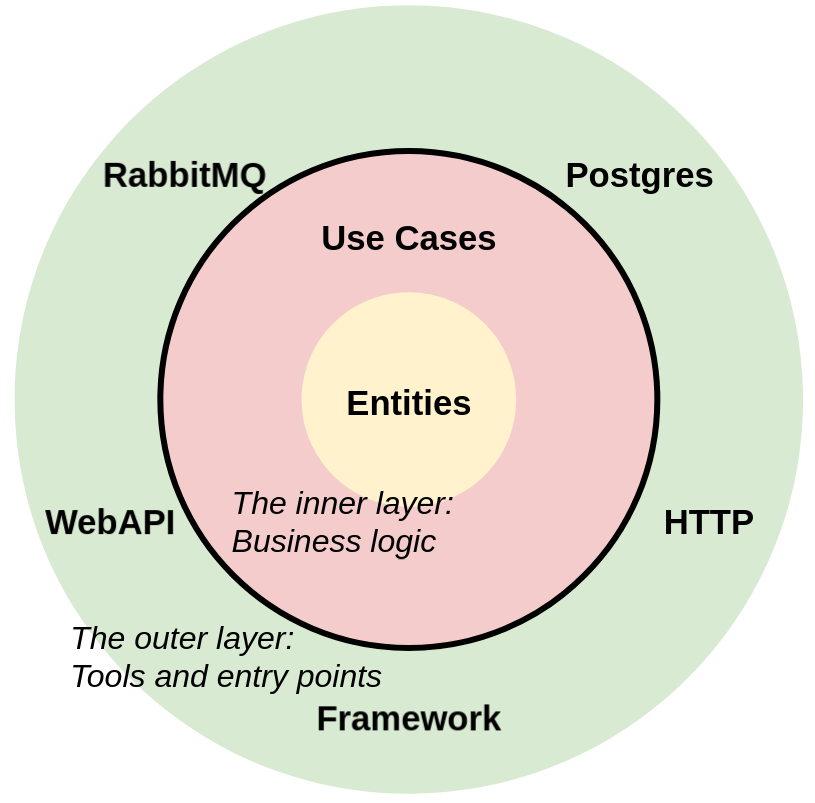

# Go Clean Template

[🇬🇧 English](README.md)

Template Clean Architecture untuk layanan Golang (Microservices)

[](https://github.com/Rivaldz/my-template-go/releases/)
[](https://github.com/Rivaldz/my-template-go/blob/master/LICENSE)
[](https://goreportcard.com/report/github.com/Rivaldz/my-template-go)

[](https://github.com/gofiber/fiber)
[](https://github.com/swaggo/swag)
[](https://github.com/go-playground/validator)
[](https://github.com/goccy/go-json)
[](https://github.com/Masterminds/squirrel)
[](https://github.com/golang-migrate/migrate)
[](https://github.com/rs/zerolog)
[](https://github.com/ansrivas/fiberprometheus)
[](https://github.com/stretchr/testify)
[](https://go.uber.org/mock)

## Ikhtisar (Overview)

Tujuan dari template ini adalah untuk menunjukkan:
- Bagaimana menyusun struktur proyek Go agar tidak menjadi kode kusut (*spaghetti code*).
- Di mana menulis logika bisnis agar tetap independen, bersih, dan mudah dikembangkan (*extensible*).
- Bagaimana mempertahankan kendali atas kode seiring bertambah besarnya microservice.

Menggunakan prinsip-prinsip arsitektur dari Robert C. Martin (Uncle Bob).

Template ini mengimplementasikan empat tipe server/transpor:
- **AMQP RPC**: berbasis RabbitMQ (menggunakan pola *Request-Reply*).
- **NATS RPC**: berbasis NATS (menggunakan pola *Request-Reply*).
- **gRPC**: framework RPC berperforma tinggi berbasis Protobuf.
- **REST API**: framework web cepat berbasis Fiber.

Proyek ini mencakup tiga domain bisnis untuk mendemonstrasikan arsitektur multi-layanan:
1. **User Authentication** — registrasi, login, dan otorisasi berbasis JWT.
2. **Task Management** — operasi CRUD tugas dengan mesin status (*status state machine*: todo, in_progress, done).
3. **Translation** — penerjemahan teks via API pihak ketiga dengan pencatatan riwayat (history).

---

## Daftar Isi
- [Domain Aplikasi](#domain-aplikasi)
- [Memulai Cepat (Quick Start)](#memulai-cepat-quick-start)
- [Struktur Proyek](#struktur-proyek)
- [Dependency Injection](#dependency-injection)
- [Clean Architecture](#clean-architecture)

---

## Domain Aplikasi

Setiap domain yang diimplementasikan di bawah ini tersedia di seluruh transpor (REST, gRPC, AMQP RPC, NATS RPC).

### 1. User Authentication (Autentikasi Pengguna)
Registrasi, login, dan otorisasi dengan token JWT.
- Password dienkripsi menggunakan `bcrypt`.
- Token JWT dengan waktu kedaluwarsa yang dapat dikonfigurasi.
- *Middleware* autentikasi terpasang di semua transpor.

| Operasi | REST | gRPC |
| :--- | :--- | :--- |
| Register | `POST /v1/auth/register` | `AuthService/Register` |
| Login | `POST /v1/auth/login` | `AuthService/Login` |
| Profil | `GET /v1/user/profile` | `AuthService/GetProfile` |

### 2. Task Management (Manajemen Tugas)
Operasi CRUD dengan alur transisi status (*state machine*).
- Alur status: `todo` → `in_progress` → `done` (dan bisa kembali ke `todo`).
- Fitur paginasi (`limit` / `offset`) serta filter status.
- Tugas dibatasi secara aman hanya untuk pengguna yang terautentikasi (*scoped by user*).

| Operasi | REST | gRPC |
| :--- | :--- | :--- |
| Create | `POST /v1/tasks` | `TaskService/CreateTask` |
| List | `GET /v1/tasks` | `TaskService/ListTasks` |
| Get | `GET /v1/tasks/:id` | `TaskService/GetTask` |
| Update | `PUT /v1/tasks/:id` | `TaskService/UpdateTask` |
| Transition | `PATCH /v1/tasks/:id/status` | `TaskService/TransitionTask` |
| Delete | `DELETE /v1/tasks/:id` | `TaskService/DeleteTask` |

### 3. Translation (Penerjemahan)
Menerjemahkan teks melalui Google Translate API eksternal dengan penyimpanan riwayat terjemahan ke database PostgreSQL.

| Operasi | REST | gRPC |
| :--- | :--- | :--- |
| Translate | `POST /v1/translation/do-translate` | `TranslationHistoryService/DoTranslate` |
| History | `GET /v1/translation/history` | `TranslationHistoryService/ShowHistory` |

---

## Memulai Cepat (Quick Start)

### Pengembangan Lokal
```sh
# Menjalankan Postgres, RabbitMQ, dan NATS di Docker
make compose-up

# Menjalankan aplikasi Go beserta auto-migrations
make run
```

### Integrasi Test (Dapat digunakan di CI/CD)
```sh
# Menjalankan database, aplikasi + migrasi, lalu menjalankan integration tests
make compose-up-integration-test
```

### Menjalankan Seluruh Stack Docker + Reverse Proxy
```sh
make compose-up-all
```

---

## Struktur Proyek

### `cmd/app/main.go`
Titik masuk utama (*entry point*) aplikasi. Digunakan untuk inisialisasi konfigurasi awal dan logger, kemudian menyerahkan alur eksekusi ke `internal/app/app.go`.

### `config`
Aplikasi mengikuti standar *Twelve-Factor App* dengan menyimpan konfigurasi di variabel lingkungan (*environment variables* / `.env`).
- Konfigurasi didefinisikan pada [config.go](config/config.go).
- Contoh konfigurasi default ada di [.env.example](.env.example).

### `docs`
Dokumentasi API Swagger yang dibuat secara otomatis oleh library [swag](https://github.com/swaggo/swag). Kamu tidak perlu mengedit file dokumentasi JSON/YAML secara manual.
- **`docs/proto`**: Menyimpan berkas Protobuf (`.proto`) yang digunakan gRPC untuk menghasilkan kode Go.

### `integration-test`
Pengujian integrasi yang dijalankan dalam container Docker terpisah di samping container aplikasi utama.

### `internal/app`
Fungsi `Run` di `app.go` bertindak sebagai kelanjutan dari fungsi *main*. Di sinilah seluruh objek diinisialisasi dan dihubungkan satu sama lain menggunakan prinsip **Dependency Injection** lewat konstruktor `New...`. File `migrate.go` digunakan untuk migrasi skema database PostgreSQL secara otomatis saat aplikasi dijalankan dengan tag `migrate`.

### `internal/controller`
Lapisan handler server (MVC Controller). Menyediakan 4 tipe transpor:
- `amqp_rpc`: Handler RPC berbasis RabbitMQ.
- `nats_rpc`: Handler RPC berbasis NATS.
- `grpc`: Handler gRPC berbasis Protobuf.
- `restapi`: Handler API REST menggunakan framework Fiber.

Setiap controller dihubungkan dengan struktur logika bisnis (*usecase*) melalui Dependency Injection.

### `internal/entity`
Menyimpan struktur entitas logika bisnis (Model). Bebas dari library pihak ketiga dan dapat diimpor oleh lapisan mana saja.

### `internal/usecase`
Pusat logika bisnis aplikasi (*domain logic*). 
- Di sinilah aturan bisnis ditulis secara murni menggunakan pustaka bawaan Go (Go Standard Library).
- Lapisan luar seperti repository database (`internal/repo/persistent`) dan web API (`internal/repo/webapi`) disuntikkan ke lapisan ini melalui *Interface*.

---

## Dependency Injection

Untuk memisahkan logika bisnis dari ketergantungan library/tools luar (seperti database atau client HTTP tertentu), kita menggunakan Dependency Injection (DI).

Logika bisnis hanya berinteraksi dengan **Interface** abstrak, bukan implementasi konkretnya.

```go
package usecase

// Logika bisnis tidak mengimpor package database luar!
type Repository interface {
	Get()
}

type UseCase struct {
	repo Repository
}

func New(r Repository) *UseCase {
	return &UseCase{
		repo: r,
	}
}

func (uc *UseCase) Do() {
	uc.repo.Get()
}
```
Metode ini memudahkan pembuatan unit test dengan menggunakan mock otomatis (menggunakan [go.uber.org/mock](https://go.uber.org/mock)).

---

## Clean Architecture

### Prinsip Utama: Inversi Ketergantungan (Dependency Inversion)
Arah ketergantungan kode selalu mengarah dari **lapisan luar** ke **lapisan dalam**. Lapisan logika bisnis murni berada di bagian paling dalam dan tidak boleh mengetahui teknologi apa yang digunakan di lapisan luar (apakah Postgres, MySQL, MongoDB, NATS, gRPC, dll.).

Aplikasi dibagi menjadi 2 area besar:
1. **Lapisan Dalam (Business Logic):** Hanya menggunakan library bawaan Go. Melakukan pemanggilan ke luar hanya lewat Interface.
2. **Lapisan Luar (Tools/Infrastruktur):** Database, HTTP Server, Message Broker, dan framework pihak ketiga. Komponen luar tidak saling tahu satu sama lain dan hanya berkomunikasi melalui lapisan dalam.



#### Skema Aliran Data
Sebagai contoh, jika sebuah HTTP Request masuk dan membutuhkan data dari PostgreSQL:
```
HTTP Controller (Luar) ──> Usecase (Dalam) ──> Repository Postgres (Luar)
HTTP Controller (Luar) <── Usecase (Dalam) <── Repository Postgres (Luar)
```
Semua persimpangan batas lapisan luar-dalam dihubungkan menggunakan Interface sehingga perubahan pada database tidak akan merusak kode logika bisnis kamu.
